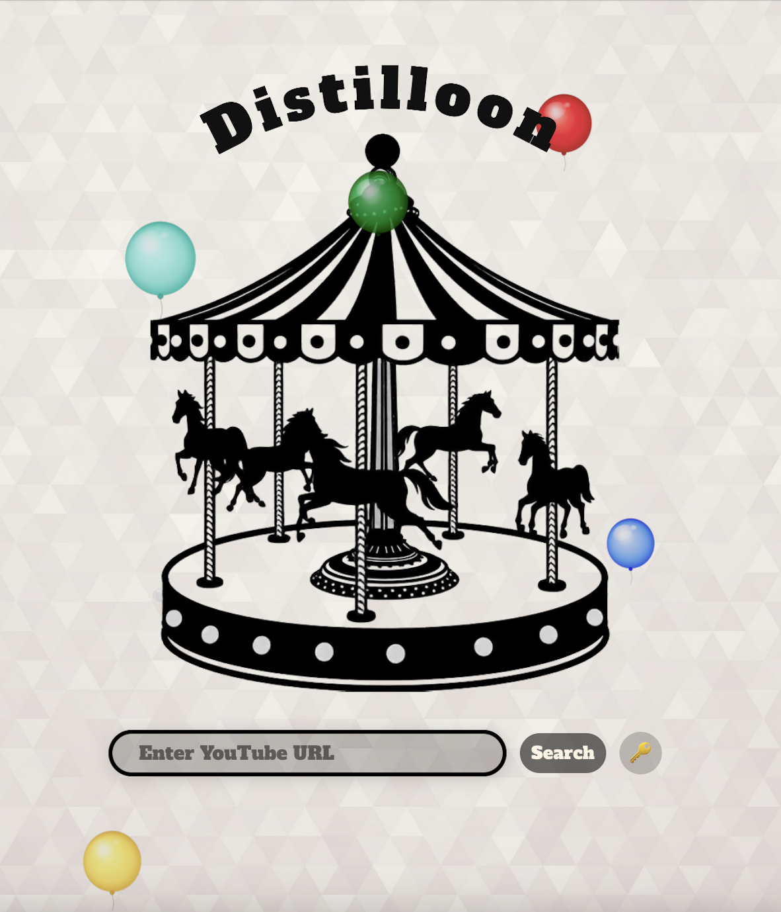
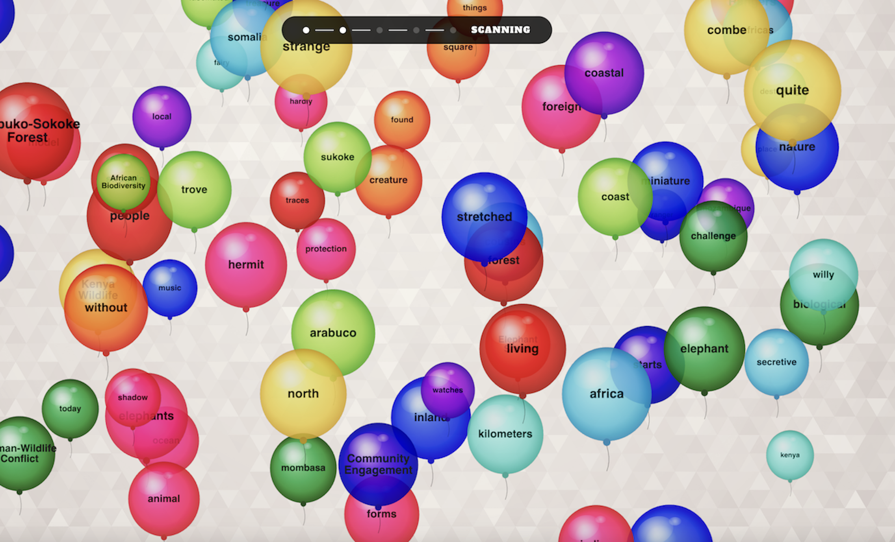
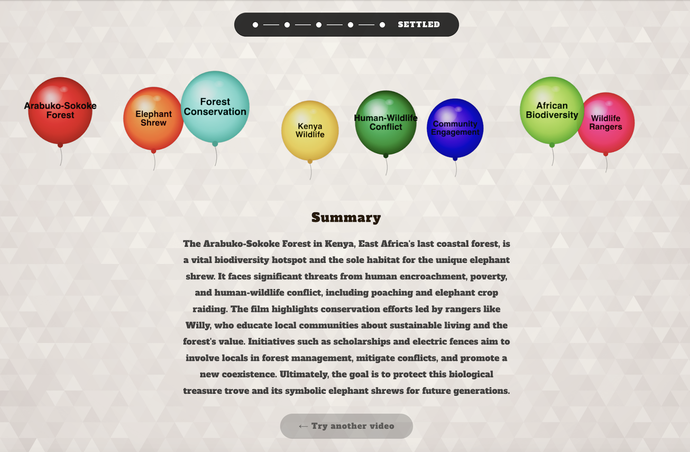

# Distilloon: AI-powered video summaries & tags

Distilloon is an interactive AI-powered tool that distills YouTube videos into 
their core meaning — surfaced as floating balloons carrying keywords and a summary.

<p align="center">
  
  
  
</p>

---

## Concept

The name **Distilloon** combines *distill* and *balloon* — two concepts that 
are more connected than they first appear.

A balloon is the perfect visual unit for a distilled idea: it holds meaning 
lightly, it's transparent enough to see through, it can pop when no longer 
needed, and the ones that matter rise above the rest.

Most AI summarization tools show only the result. Distilloon shows the **process** — the moment when AI scans, selects, and distills information from a video into its core meaning. This project is a prototype of what YouTube's AI UI moments could feel like — communicating system activity through motion, not just text.

The visual metaphor:
- A carousel at rest → **idle state**, waiting for input
- Balloons carrying words scatter across the screen → **AI processing**, scanning the full transcript
- Unimportant balloons pop and disappear → **selection**, filtering noise
- Key concept balloons settle into a row → **crystallization**, the result emerges
- A summary appears below → **settled state**, meaning delivered

This makes the tool useful in two ways:
- **For viewers** — get the essence of a video before or after watching
- **For creators** — discover the 8 most meaningful tags for their video, ready to copy into YouTube Studio

---

## Design System

This project demonstrates a scalable visual language for AI state communication, applicable across YouTube's ecosystem:

| State | Visual Behavior | Meaning |
|---|---|---|
| `IDLE` | Carousel rotates slowly, a few balloons float up | System is ready |
| `DISSOLUTION` | Dozens of word-filled balloons fill the screen | AI is reading the full transcript |
| `SCANNING` | Keyword balloons glow and grow | AI identifies important concepts |
| `FOG` | Non-keyword balloons pop and vanish | AI filters out noise |
| `CRYSTALLIZATION` | Selected balloons converge to center | AI consolidates meaning |
| `SETTLED` | Keyword balloons line up, summary appears | Result delivered |

The same 5-state visual grammar could be applied to other YouTube AI features:
- **Creator tools** — thumbnail generation, title suggestions, tag optimization
- **Content moderation** — signal detection, policy review
- **Discovery** — search intent resolution, recommendation generation

---

## Tech Stack

- **Next.js 14** (App Router)
- **React Three Fiber** + **Three.js** — 3D balloon particle system
- **Gemini API** (`gemini-2.5-flash`) — transcript summarization and keyword extraction
- **youtube-transcript** — transcript fetching
- **TypeScript**
- **Vercel** — deployment

---

## Architecture

```
User enters YouTube URL
        ↓
/api/process (Next.js Route Handler)
        ↓
youtube-transcript → raw transcript text
        ↓
Gemini API → 8 keywords + summary (JSON)
        ↓
Meaningful words extracted from transcript (stop-word filtered)
        ↓
LibraryScene (React Three Fiber)
        ↓
5-phase balloon animation with real data
```

---

## Getting Started

### Prerequisites

- Node.js 18+
- A Google API Key with Gemini API enabled

### Installation

```bash
git clone https://github.com/your-username/youtube-library
cd youtube-library
npm install
npm run dev
```

Open [http://localhost:3000](http://localhost:3000).

### API Key Setup

Click the 🔑 icon next to the search bar and enter your Google API Key. The key is stored locally in your browser and never sent to any server other than Google's APIs directly.

Get a free API key at [console.cloud.google.com](https://console.cloud.google.com).

---

## Technical Notes

### Transcript Fetching

This prototype fetches YouTube captions via the `youtube-transcript` library, which accesses publicly available caption data without requiring authentication.

**Production implementation** would use OAuth 2.0 via the official YouTube Data API v3 (`captions.download`), ensuring full compliance with YouTube's Terms of Service and reliable access across all video types.

This was a deliberate design decision: requiring OAuth login would create unnecessary friction for portfolio reviewers who want to experience the UI immediately. The architecture is structured so that replacing the `getTranscript()` function is the only change needed to switch to OAuth.

### Extensibility

The transcript layer is intentionally abstracted. Future integrations could include:

- **Vimeo** via Vimeo API
- **Any audio/video file** via OpenAI Whisper API (speech-to-text)
- **Podcasts** via RSS feed + Whisper
- **Any webpage** via text extraction

### BYOK (Bring Your Own Key)

API keys are stored in `localStorage` and sent only to Google's APIs. No keys are stored server-side.

---

### Language Support
Transcripts are fetched in the video's original language. Keywords are returned 
in the source language. Summaries are generally returned in English, though 
videos with English-language transcripts may produce summaries in the source 
language depending on Gemini's response. Full multilingual summary support 
would require explicit language instructions in the prompt.

---

## Design Decisions

**Why a carousel?**
The carousel is a universal symbol of circular, repetitive motion — mirroring the way AI processes text by repeatedly scanning for patterns. The transition from "toy at rest" to "chaos in motion" when processing begins creates immediate visual impact.

**Why balloons?**
Balloons are inherently impermanent — they float, drift, and pop. This makes them a natural metaphor for candidate tokens: present for a moment, then selected or discarded. Their transparency allows layering that communicates density of information.

**Why black and white for the carousel, color for the balloons?**
The monochrome carousel represents the static, pre-AI state. Color only enters the scene when AI activates — visually communicating that AI brings richness and meaning to content.

---

## License

MIT
